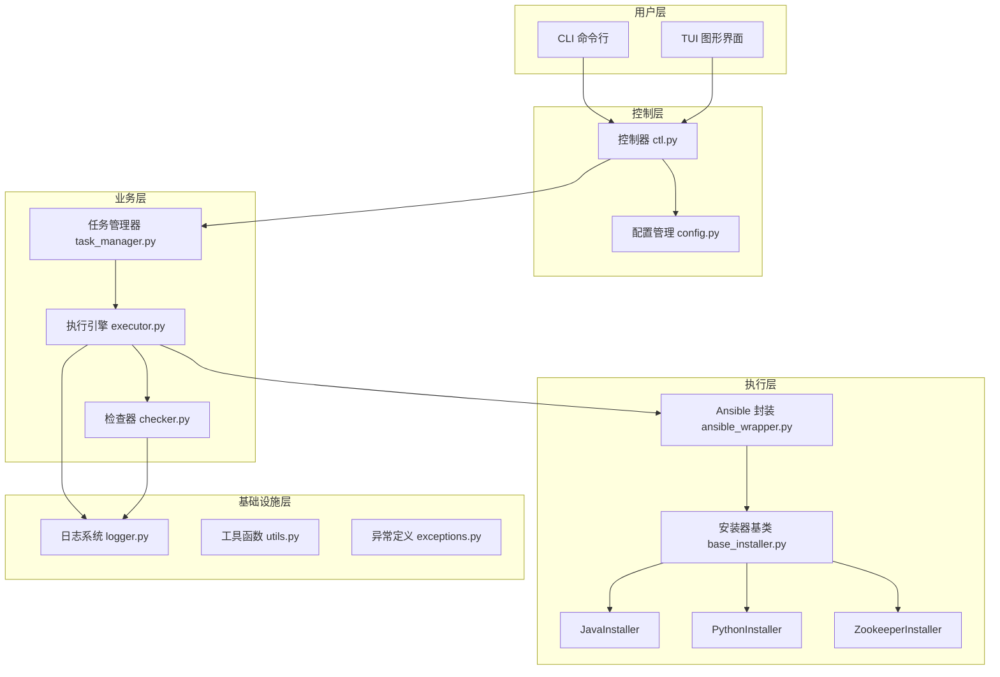
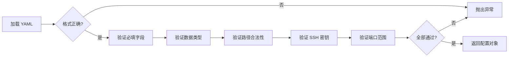
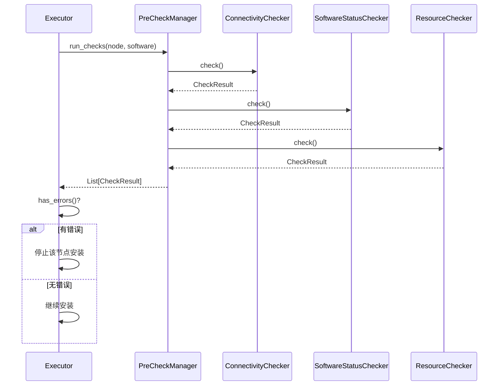
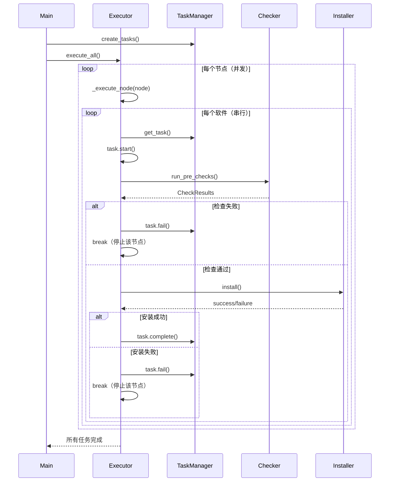
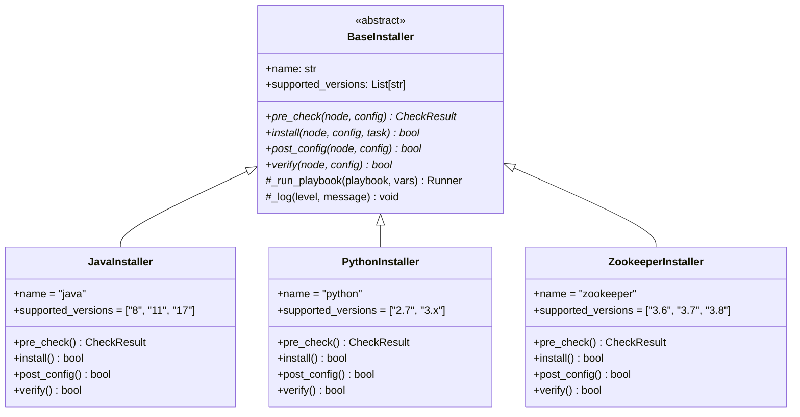
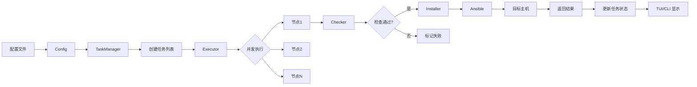
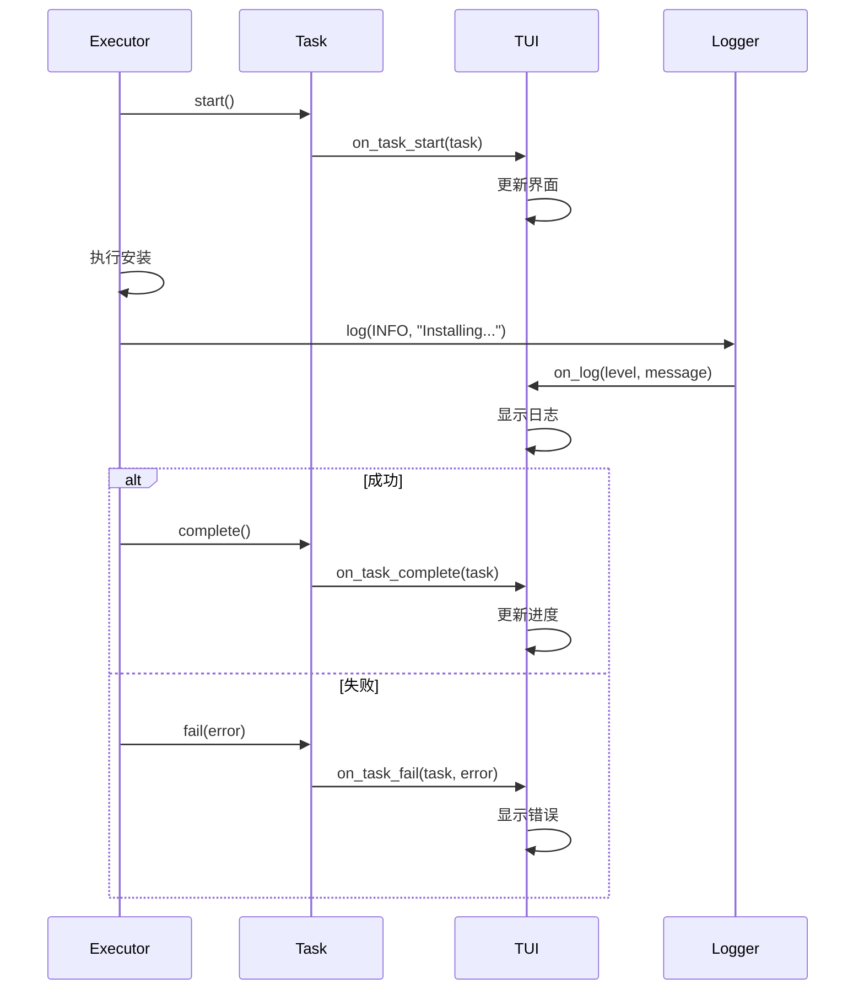
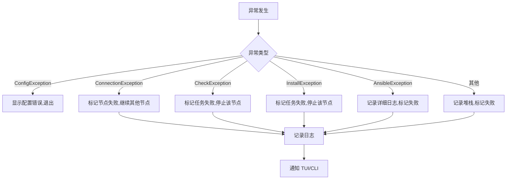

# Auto Deploy 技术设计文档

**版本**: 1.0  
**日期**: 2025-11-20  
**项目**: Auto Deploy - 自动化部署工具

---

## 1. 系统架构设计

### 1.1 整体架构



### 1.2 架构分层说明

| 层级 | 职责 | 主要模块 |
|------|------|----------|
| **用户层** | 用户交互界面 | CLI, TUI |
| **控制层** | 请求路由和配置管理 | ctl.py, config.py |
| **业务层** | 任务调度和执行控制 | task_manager.py, executor.py, checker.py |
| **执行层** | Ansible 执行和软件安装 | ansible_wrapper.py, installers |
| **基础设施层** | 日志、工具、异常处理 | logger.py, utils.py, exceptions.py |

### 1.3 设计原则

1. **单一职责原则**: 每个模块只负责一个功能领域
2. **开闭原则**: 对扩展开放（新增软件安装器）,对修改封闭（核心逻辑不变）
3. **依赖倒置原则**: 依赖抽象（BaseInstaller）而非具体实现
4. **接口隔离原则**: 定义清晰的模块接口
5. **最小知识原则**: 模块间通过明确的接口通信

---

## 2. 核心模块设计

### 2.1 配置管理模块（config.py）

#### 2.1.1 类设计

```python
from typing import Dict, List, Optional, Any
from dataclasses import dataclass

@dataclass
class NodeConfig:
    """节点配置"""
    name: str
    host: str
    port: int = 22
    owner_user: str = ''
    owner_pass: Optional[str] = None
    owner_key: Optional[str] = None
    super_user: str = 'root'
    super_pass: Optional[str] = None
    super_key: Optional[str] = None
    install: List[Dict[str, Any]] = None
    
    def validate(self) -> None:
        """验证配置完整性"""
        pass

@dataclass
class SoftwareConfig:
    """软件配置"""
    name: str
    version: str
    install_path: str
    source: str = 'repository'  # local/url/repository
    source_path: Optional[str] = None
    config: Dict[str, Any] = None

class Config:
    """配置管理类（已有,需扩展）"""
    
    def __init__(self, config_file: str) -> None:
        """初始化配置"""
        pass
    
    def get_nodes(self) -> List[NodeConfig]:
        """获取所有节点配置"""
        pass
    
    def get_max_concurrent_nodes(self) -> int:
        """获取最大并发节点数"""
        pass
    
    def validate_all(self) -> List[str]:
        """验证所有配置,返回错误列表"""
        pass
```

#### 2.1.2 配置验证流程



---

### 2.2 安装前检查模块（checker.py）

#### 2.2.1 类设计

```python
from abc import ABC, abstractmethod
from enum import Enum
from typing import List, Dict, Any

class CheckLevel(Enum):
    """检查级别"""
    INFO = "info"
    WARNING = "warning"
    ERROR = "error"

@dataclass
class CheckResult:
    """检查结果"""
    check_name: str
    level: CheckLevel
    passed: bool
    message: str
    details: Dict[str, Any] = None

class BaseChecker(ABC):
    """检查器基类"""
    
    @abstractmethod
    def check(self, node: NodeConfig, software: SoftwareConfig) -> CheckResult:
        """执行检查"""
        pass

class ConnectivityChecker(BaseChecker):
    """连通性检查器"""
    
    def check(self, node: NodeConfig, software: SoftwareConfig = None) -> CheckResult:
        """检查 SSH 连通性和权限"""
        pass

class SoftwareStatusChecker(BaseChecker):
    """软件安装状态检查器"""
    
    def check(self, node: NodeConfig, software: SoftwareConfig) -> CheckResult:
        """检查软件是否已安装"""
        pass

class SystemCompatibilityChecker(BaseChecker):
    """系统兼容性检查器"""
    
    def check(self, node: NodeConfig, software: SoftwareConfig) -> CheckResult:
        """检查操作系统兼容性"""
        pass

class ResourceChecker(BaseChecker):
    """资源检查器"""
    
    def check(self, node: NodeConfig, software: SoftwareConfig) -> CheckResult:
        """检查磁盘空间、内存等资源"""
        pass

class DependencyChecker(BaseChecker):
    """依赖检查器"""
    
    def check(self, node: NodeConfig, software: SoftwareConfig) -> CheckResult:
        """检查软件依赖"""
        pass

class PreCheckManager:
    """检查管理器"""
    
    def __init__(self):
        self.checkers: List[BaseChecker] = [
            ConnectivityChecker(),
            SoftwareStatusChecker(),
            SystemCompatibilityChecker(),
            ResourceChecker(),
            DependencyChecker(),
        ]
    
    def run_checks(self, node: NodeConfig, software: SoftwareConfig) -> List[CheckResult]:
        """运行所有检查"""
        results = []
        for checker in self.checkers:
            result = checker.check(node, software)
            results.append(result)
        return results
    
    def has_errors(self, results: List[CheckResult]) -> bool:
        """是否存在错误"""
        return any(r.level == CheckLevel.ERROR and not r.passed for r in results)
```

#### 2.2.2 检查流程



---

### 2.3 任务管理模块（task_manager.py）

#### 2.3.1 类设计

```python
from enum import Enum
from dataclasses import dataclass
from typing import Optional, Callable
import time

class TaskStatus(Enum):
    """任务状态"""
    PENDING = "pending"
    RUNNING = "running"
    COMPLETED = "completed"
    FAILED = "failed"
    SKIPPED = "skipped"

@dataclass
class Task:
    """任务定义"""
    task_id: str
    node_name: str
    software_name: str
    software_version: str
    status: TaskStatus = TaskStatus.PENDING
    progress: float = 0.0
    start_time: Optional[float] = None
    end_time: Optional[float] = None
    error_message: Optional[str] = None
    
    def start(self) -> None:
        """开始任务"""
        self.status = TaskStatus.RUNNING
        self.start_time = time.time()
    
    def complete(self) -> None:
        """完成任务"""
        self.status = TaskStatus.COMPLETED
        self.progress = 100.0
        self.end_time = time.time()
    
    def fail(self, error: str) -> None:
        """任务失败"""
        self.status = TaskStatus.FAILED
        self.end_time = time.time()
        self.error_message = error
    
    def skip(self, reason: str) -> None:
        """跳过任务"""
        self.status = TaskStatus.SKIPPED
        self.error_message = reason

class TaskManager:
    """任务管理器"""
    
    def __init__(self, config: Config):
        self.config = config
        self.tasks: Dict[str, Task] = {}
        self.node_tasks: Dict[str, List[str]] = {}  # node_name -> task_ids
    
    def create_tasks(self) -> None:
        """根据配置创建所有任务"""
        nodes = self.config.get_nodes()
        for node in nodes:
            task_ids = []
            for software_dict in node.install:
                for sw_name, sw_config in software_dict.items():
                    task_id = f"{node.name}_{sw_name}_{sw_config.get('version', 'latest')}"
                    task = Task(
                        task_id=task_id,
                        node_name=node.name,
                        software_name=sw_name,
                        software_version=sw_config.get('version', 'latest')
                    )
                    self.tasks[task_id] = task
                    task_ids.append(task_id)
            self.node_tasks[node.name] = task_ids
    
    def get_task(self, task_id: str) -> Optional[Task]:
        """获取任务"""
        return self.tasks.get(task_id)
    
    def get_node_tasks(self, node_name: str) -> List[Task]:
        """获取节点的所有任务"""
        task_ids = self.node_tasks.get(node_name, [])
        return [self.tasks[tid] for tid in task_ids]
    
    def get_all_tasks(self) -> List[Task]:
        """获取所有任务"""
        return list(self.tasks.values())
    
    def get_statistics(self) -> Dict[str, int]:
        """获取统计信息"""
        stats = {
            'total': len(self.tasks),
            'pending': 0,
            'running': 0,
            'completed': 0,
            'failed': 0,
            'skipped': 0,
        }
        for task in self.tasks.values():
            stats[task.status.value] += 1
        return stats
```

---

### 2.4 执行引擎模块（executor.py）

#### 2.4.1 类设计

```python
from concurrent.futures import ThreadPoolExecutor, Future
from typing import Dict, List, Callable
import threading

class DeploymentExecutor:
    """部署执行引擎"""
    
    def __init__(self, config: Config, task_manager: TaskManager):
        self.config = config
        self.task_manager = task_manager
        self.max_workers = config.get_max_concurrent_nodes()
        self.executor = ThreadPoolExecutor(max_workers=self.max_workers)
        self.futures: Dict[str, Future] = {}
        self.lock = threading.Lock()
        self.stop_event = threading.Event()
        self.pause_event = threading.Event()
        self.pause_event.set()  # 初始为非暂停状态
        
        # 回调函数
        self.on_task_start: Optional[Callable[[Task], None]] = None
        self.on_task_complete: Optional[Callable[[Task], None]] = None
        self.on_task_fail: Optional[Callable[[Task, str], None]] = None
        self.on_log: Optional[Callable[[str, str], None]] = None  # (level, message)
    
    def execute_all(self) -> None:
        """执行所有任务"""
        nodes = self.config.get_nodes()
        for node in nodes:
            if self.stop_event.is_set():
                break
            future = self.executor.submit(self._execute_node, node)
            self.futures[node.name] = future
    
    def _execute_node(self, node: NodeConfig) -> None:
        """执行单个节点的所有任务"""
        tasks = self.task_manager.get_node_tasks(node.name)
        
        for task in tasks:
            # 检查暂停和停止
            self.pause_event.wait()
            if self.stop_event.is_set():
                task.skip("Deployment stopped by user")
                break
            
            try:
                # 开始任务
                task.start()
                if self.on_task_start:
                    self.on_task_start(task)
                
                # 安装前检查
                software_config = self._get_software_config(node, task.software_name)
                check_results = self._run_pre_checks(node, software_config)
                
                if self._has_check_errors(check_results):
                    error_msg = self._format_check_errors(check_results)
                    task.fail(error_msg)
                    if self.on_task_fail:
                        self.on_task_fail(task, error_msg)
                    break  # 停止该节点的后续任务
                
                # 执行安装
                installer = self._get_installer(task.software_name)
                installer.install(node, software_config, task)
                
                # 完成任务
                task.complete()
                if self.on_task_complete:
                    self.on_task_complete(task)
                
            except Exception as e:
                error_msg = f"Unexpected error: {str(e)}"
                task.fail(error_msg)
                if self.on_task_fail:
                    self.on_task_fail(task, error_msg)
                break  # 停止该节点的后续任务
    
    def pause(self) -> None:
        """暂停部署"""
        self.pause_event.clear()
    
    def resume(self) -> None:
        """恢复部署"""
        self.pause_event.set()
    
    def stop(self) -> None:
        """停止部署"""
        self.stop_event.set()
        self.executor.shutdown(wait=False)
    
    def wait_completion(self) -> None:
        """等待所有任务完成"""
        self.executor.shutdown(wait=True)
```

#### 2.4.2 执行流程



---

### 2.5 Ansible 集成模块（ansible_wrapper.py）

#### 2.5.1 类设计

```python
import ansible_runner
from typing import Dict, Any, Optional, Callable
from pathlib import Path

class AnsibleWrapper:
    """Ansible Runner 封装"""
    
    def __init__(self, private_data_dir: str):
        self.private_data_dir = Path(private_data_dir)
        self.private_data_dir.mkdir(parents=True, exist_ok=True)
    
    def run_playbook(
        self,
        playbook_path: str,
        inventory: Dict[str, Any],
        extravars: Dict[str, Any] = None,
        on_event: Optional[Callable[[Dict], None]] = None
    ) -> ansible_runner.Runner:
        """
        执行 Ansible Playbook
        
        Args:
            playbook_path: Playbook 文件路径
            inventory: 主机清单
            extravars: 额外变量
            on_event: 事件回调函数
        
        Returns:
            Runner 对象
        """
        runner = ansible_runner.run(
            private_data_dir=str(self.private_data_dir),
            playbook=playbook_path,
            inventory=inventory,
            extravars=extravars or {},
            event_handler=on_event,
            quiet=False,
        )
        return runner
    
    def check_connection(self, host: str, port: int, user: str, 
                        password: str = None, private_key: str = None) -> bool:
        """检查 SSH 连接"""
        inventory = {
            'all': {
                'hosts': {
                    host: {
                        'ansible_host': host,
                        'ansible_port': port,
                        'ansible_user': user,
                    }
                }
            }
        }
        
        if password:
            inventory['all']['hosts'][host]['ansible_password'] = password
        if private_key:
            inventory['all']['hosts'][host]['ansible_ssh_private_key_file'] = private_key
        
        # 使用 ping 模块测试连接
        runner = ansible_runner.run(
            private_data_dir=str(self.private_data_dir),
            module='ping',
            host_pattern=host,
            inventory=inventory,
        )
        
        return runner.status == 'successful'
```

---

### 2.6 安装器模块（installers/）

#### 2.6.1 类层次结构



#### 2.6.2 基类实现

```python
from abc import ABC, abstractmethod
from typing import Dict, Any, List
from pathlib import Path

class BaseInstaller(ABC):
    """安装器基类"""
    
    name: str = ""
    supported_versions: List[str] = []
    
    def __init__(self, ansible_wrapper: AnsibleWrapper, logger):
        self.ansible = ansible_wrapper
        self.logger = logger
        self.playbook_dir = Path(__file__).parent.parent / 'playbook'
    
    @abstractmethod
    def pre_check(self, node: NodeConfig, config: SoftwareConfig) -> CheckResult:
        """
        安装前检查
        
        Returns:
            CheckResult: 检查结果
        """
        pass
    
    @abstractmethod
    def install(self, node: NodeConfig, config: SoftwareConfig, task: Task) -> bool:
        """
        执行安装
        
        Args:
            node: 节点配置
            config: 软件配置
            task: 任务对象（用于更新进度）
        
        Returns:
            bool: 是否成功
        """
        pass
    
    def post_config(self, node: NodeConfig, config: SoftwareConfig) -> bool:
        """
        安装后配置（可选）
        
        Returns:
            bool: 是否成功
        """
        return True
    
    def verify(self, node: NodeConfig, config: SoftwareConfig) -> bool:
        """
        验证安装（可选）
        
        Returns:
            bool: 是否成功
        """
        return True
    
    def _run_playbook(self, playbook_name: str, extravars: Dict[str, Any]) -> ansible_runner.Runner:
        """运行 Playbook"""
        playbook_path = self.playbook_dir / playbook_name
        # 实现省略
        pass
    
    def _log(self, level: str, message: str) -> None:
        """记录日志"""
        self.logger.log(level, f"[{self.name}] {message}")
```

#### 2.6.3 Java 安装器示例

```python
class JavaInstaller(BaseInstaller):
    """Java 安装器"""
    
    name = "java"
    supported_versions = ["8", "11", "17"]
    
    def pre_check(self, node: NodeConfig, config: SoftwareConfig) -> CheckResult:
        """检查 Java 是否已安装"""
        # 使用 Ansible 检查 java -version
        # 实现省略
        pass
    
    def install(self, node: NodeConfig, config: SoftwareConfig, task: Task) -> bool:
        """安装 Java"""
        self._log("INFO", f"Installing Java {config.version} on {node.name}")
        
        # 准备变量
        extravars = {
            'java_version': config.version,
            'install_path': config.install_path,
            'source_url': config.source_path,
        }
        
        # 运行 Playbook
        runner = self._run_playbook('install_java.yml', extravars)
        
        if runner.status == 'successful':
            self._log("INFO", f"Java {config.version} installed successfully")
            return True
        else:
            self._log("ERROR", f"Java installation failed: {runner.stderr}")
            return False
    
    def post_config(self, node: NodeConfig, config: SoftwareConfig) -> bool:
        """配置环境变量"""
        if config.config and config.config.get('set_java_home'):
            # 设置 JAVA_HOME
            pass
        return True
```

---

### 2.7 TUI 模块（tui/）

#### 2.7.1 组件结构

```
tui/
├── __init__.py          # DeployApp 主应用
├── screens/
│   └── main_screen.py   # 主界面
├── widgets/
│   ├── node_tree.py     # 节点树形列表
│   ├── progress_panel.py # 进度面板
│   └── log_viewer.py    # 日志查看器
└── css/
    └── main.css         # 样式文件
```

#### 2.7.2 主应用类

```python
from textual.app import App, ComposeResult
from textual.containers import Container, Horizontal, Vertical
from textual.widgets import Header, Footer
from tui.widgets.node_tree import NodeTree
from tui.widgets.progress_panel import ProgressPanel
from tui.widgets.log_viewer import LogViewer

class DeployApp(App):
    """部署 TUI 应用"""
    
    CSS_PATH = "css/main.css"
    BINDINGS = [
        ("s", "start", "Start"),
        ("p", "pause", "Pause"),
        ("r", "resume", "Resume"),
        ("q", "quit", "Quit"),
    ]
    
    def __init__(self, executor: DeploymentExecutor, task_manager: TaskManager):
        super().__init__()
        self.executor = executor
        self.task_manager = task_manager
    
    def compose(self) -> ComposeResult:
        """构建界面"""
        yield Header()
        with Horizontal():
            yield NodeTree(id="node-tree")
            with Vertical():
                yield ProgressPanel(id="progress-panel")
                yield LogViewer(id="log-viewer")
        yield Footer()
    
    def on_mount(self) -> None:
        """挂载时初始化"""
        # 绑定回调
        self.executor.on_task_start = self._on_task_start
        self.executor.on_task_complete = self._on_task_complete
        self.executor.on_task_fail = self._on_task_fail
        self.executor.on_log = self._on_log
    
    def action_start(self) -> None:
        """开始部署"""
        self.executor.execute_all()
    
    def action_pause(self) -> None:
        """暂停部署"""
        self.executor.pause()
    
    def action_resume(self) -> None:
        """恢复部署"""
        self.executor.resume()
    
    def _on_task_start(self, task: Task) -> None:
        """任务开始回调"""
        node_tree = self.query_one("#node-tree", NodeTree)
        node_tree.update_task_status(task)
    
    def _on_task_complete(self, task: Task) -> None:
        """任务完成回调"""
        node_tree = self.query_one("#node-tree", NodeTree)
        node_tree.update_task_status(task)
        
        progress_panel = self.query_one("#progress-panel", ProgressPanel)
        progress_panel.update_progress(self.task_manager.get_statistics())
    
    def _on_log(self, level: str, message: str) -> None:
        """日志回调"""
        log_viewer = self.query_one("#log-viewer", LogViewer)
        log_viewer.add_log(level, message)
```

#### 2.7.3 节点树组件

```python
from textual.widgets import Tree
from textual.widgets._tree import TreeNode

class NodeTree(Tree):
    """节点状态树"""
    
    def __init__(self, *args, **kwargs):
        super().__init__("Nodes", *args, **kwargs)
        self.node_map: Dict[str, TreeNode] = {}
    
    def build_tree(self, task_manager: TaskManager) -> None:
        """构建节点树"""
        nodes = {}
        for task in task_manager.get_all_tasks():
            if task.node_name not in nodes:
                node = self.root.add(f"📦 {task.node_name}")
                nodes[task.node_name] = node
            
            task_node = nodes[task.node_name].add(
                f"⏸ {task.software_name} {task.software_version}"
            )
            self.node_map[task.task_id] = task_node
    
    def update_task_status(self, task: Task) -> None:
        """更新任务状态"""
        if task.task_id in self.node_map:
            node = self.node_map[task.task_id]
            icon = self._get_status_icon(task.status)
            node.label = f"{icon} {task.software_name} {task.software_version}"
    
    def _get_status_icon(self, status: TaskStatus) -> str:
        """获取状态图标"""
        icons = {
            TaskStatus.PENDING: "⏸",
            TaskStatus.RUNNING: "⏳",
            TaskStatus.COMPLETED: "✓",
            TaskStatus.FAILED: "✗",
            TaskStatus.SKIPPED: "⚠",
        }
        return icons.get(status, "?")
```

---

### 2.8 日志模块（common/logger.py）

#### 2.8.1 类设计

```python
import logging
from logging.handlers import RotatingFileHandler
from pathlib import Path
from typing import Optional

class DeployLogger:
    """部署日志管理器"""
    
    def __init__(self, log_dir: str, log_level: str = "INFO"):
        self.log_dir = Path(log_dir)
        self.log_dir.mkdir(parents=True, exist_ok=True)
        self.log_level = getattr(logging, log_level.upper())
        
        # 主日志
        self.main_logger = self._create_logger(
            "deploy",
            self.log_dir / "deploy.log"
        )
        
        # 节点日志
        self.node_loggers: Dict[str, logging.Logger] = {}
    
    def _create_logger(self, name: str, log_file: Path) -> logging.Logger:
        """创建日志器"""
        logger = logging.getLogger(name)
        logger.setLevel(self.log_level)
        
        # 文件处理器（带轮转）
        file_handler = RotatingFileHandler(
            log_file,
            maxBytes=10*1024*1024,  # 10MB
            backupCount=5
        )
        file_handler.setLevel(self.log_level)
        
        # 格式化
        formatter = logging.Formatter(
            '%(asctime)s - %(name)s - %(levelname)s - %(message)s'
        )
        file_handler.setFormatter(formatter)
        
        logger.addHandler(file_handler)
        return logger
    
    def get_node_logger(self, node_name: str) -> logging.Logger:
        """获取节点日志器"""
        if node_name not in self.node_loggers:
            log_file = self.log_dir / f"{node_name}.log"
            self.node_loggers[node_name] = self._create_logger(
                f"deploy.{node_name}",
                log_file
            )
        return self.node_loggers[node_name]
    
    def log(self, level: str, message: str, node: Optional[str] = None) -> None:
        """记录日志"""
        logger = self.main_logger
        if node:
            logger = self.get_node_logger(node)
        
        log_method = getattr(logger, level.lower())
        log_method(message)
```

---

## 3. 数据流设计

### 3.1 部署流程数据流



### 3.2 事件流



---

## 4. 接口定义

### 4.1 模块间接口

| 调用方 | 被调用方 | 接口方法 | 说明 |
|--------|----------|----------|------|
| ctl.py | Config | `__init__(config_file)` | 加载配置 |
| ctl.py | TaskManager | `create_tasks()` | 创建任务 |
| ctl.py | Executor | `execute_all()` | 执行部署 |
| Executor | Checker | `run_checks(node, software)` | 执行检查 |
| Executor | Installer | `install(node, config, task)` | 执行安装 |
| Installer | AnsibleWrapper | `run_playbook(...)` | 运行 Playbook |
| Executor | Logger | `log(level, message, node)` | 记录日志 |
| TUI | Executor | 设置回调函数 | 接收事件 |

### 4.2 回调接口

```python
# Executor 提供的回调接口
on_task_start: Callable[[Task], None]
on_task_complete: Callable[[Task], None]
on_task_fail: Callable[[Task, str], None]
on_log: Callable[[str, str], None]  # (level, message)
```

---

## 5. 错误处理策略

### 5.1 异常层次

```python
# common/exceptions.py

class DeployException(Exception):
    """部署异常基类"""
    pass

class ConfigException(DeployException):
    """配置异常"""
    pass

class ConnectionException(DeployException):
    """连接异常"""
    pass

class CheckException(DeployException):
    """检查异常"""
    pass

class InstallException(DeployException):
    """安装异常"""
    pass

class AnsibleException(DeployException):
    """Ansible 执行异常"""
    pass
```

### 5.2 错误处理流程



---

## 6. 性能优化

### 6.1 并发优化
- 使用线程池限制并发数,避免资源耗尽
- 节点间并行,节点内串行,平衡效率和依赖关系
- 使用 `threading.Event` 实现暂停/恢复,无需轮询

### 6.2 内存优化
- Ansible 输出流式处理,不全部加载到内存
- 日志文件轮转,避免单文件过大
- 任务状态使用枚举,减少内存占用

### 6.3 IO 优化
- 异步日志写入（使用 `QueueHandler`）
- 批量更新 TUI 界面,减少刷新频率
- Playbook 文件预加载验证

---

## 7. 安全设计

### 7.1 凭证安全
- 配置文件权限检查（建议 600）
- SSH 私钥权限检查（必须 600）
- 日志中密码脱敏处理

### 7.2 执行安全
- Ansible 使用最小权限用户
- 安装路径权限验证
- 禁止执行任意命令（仅允许预定义 Playbook）

---

## 8. 测试策略

### 8.1 单元测试
- 配置解析和验证
- 检查器逻辑
- 任务状态转换
- 工具函数

### 8.2 集成测试
- Ansible Wrapper 与真实 Playbook
- Executor 与 TaskManager 协作
- TUI 界面渲染

### 8.3 端到端测试
- 完整部署流程（使用测试环境）
- 错误场景测试（网络中断、权限不足等）

---

**文档结束**
